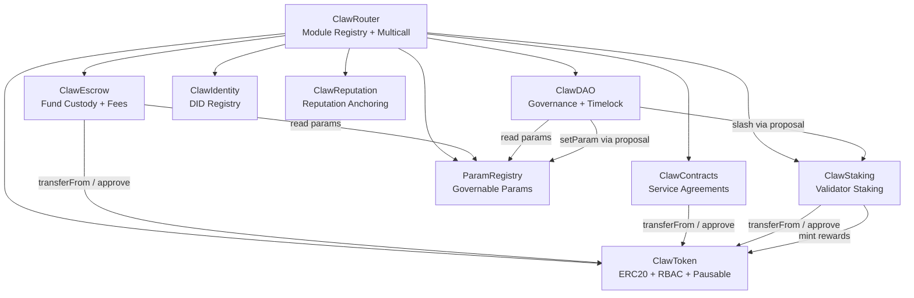

# ClawNet Smart Contracts — Audit Documentation Pack

> **Version**: 1.0  
> **Date**: 2025-02-23  
> **Prepared for**: External security audit  
> **Repo**: `packages/contracts/` within root monorepo  
> **Internal audit**: See [internal-audit-report.md](internal-audit-report.md)

---

## Table of Contents

1. [Project Overview](#1-project-overview)
2. [Contract Architecture](#2-contract-architecture)
3. [Contract Inventory](#3-contract-inventory)
4. [Dependency Graph](#4-dependency-graph)
5. [Permission Matrix (RBAC)](#5-permission-matrix-rbac)
6. [External Dependencies](#6-external-dependencies)
7. [Interface Specifications](#7-interface-specifications)
8. [Key Business Logic](#8-key-business-logic)
9. [Economic Parameters](#9-economic-parameters)
10. [Known Risks & Design Trade-offs](#10-known-risks--design-trade-offs)
11. [Test Coverage Report](#11-test-coverage-report)
12. [Build & Test Instructions](#12-build--test-instructions)
13. [Deployment Information](#13-deployment-information)

---

## 1. Project Overview

**ClawNet** is a decentralized agent-to-agent service marketplace. The on-chain layer consists of 9 UUPS-upgradeable smart contracts that manage:

- **Token economy**: ERC20 Token with role-based mint/burn
- **Identity**: DID registration, key rotation, and revocation
- **Escrow**: Fund custody with fee calculations and dispute resolution
- **Service contracts**: Milestone-based work agreements between agents
- **Staking**: Node validator staking with slashing and reward distribution
- **Reputation**: Off-chain reputation anchoring with Merkle proof verification
- **DAO governance**: Proposal/vote/timelock/emergency multi-sig governance
- **Parameter registry**: On-chain key-value store for governable parameters
- **Router**: Unified entry point for module registration and multicall

**Currency unit**: The native currency is called **Token** (1 Token = 1 unit, 0 decimals).

---

## 2. Contract Architecture



### Architecture Principles

- **UUPS proxy pattern** (OpenZeppelin v5): All 9 contracts are deployed behind ERC-1967 proxies. Upgrade authorization requires `DEFAULT_ADMIN_ROLE`.
- **Standalone modules**: `ClawIdentity` and `ClawReputation` have no cross-contract dependencies — they store data independently.
- **Shared Token**: `ClawEscrow`, `ClawContracts`, `ClawStaking`, and `ClawDAO` all interact with `ClawToken` via `IERC20` (SafeERC20).
- **Parameter governance**: `ParamRegistry` stores tunable parameters; `ClawDAO` holds `GOVERNOR_ROLE` to modify them via governance proposals.

---

## 3. Contract Inventory

| # | Contract | File | LOC | Description |
|---|----------|------|-----|-------------|
| 1 | ClawToken | `contracts/ClawToken.sol` | 83 | ERC20 token with mint/burn/pause |
| 2 | ClawEscrow | `contracts/ClawEscrow.sol` | 407 | Escrow custody, fee calculation, dispute flow |
| 3 | ClawIdentity | `contracts/ClawIdentity.sol` | 356 | DID hash registration, key rotation, revocation |
| 4 | ClawStaking | `contracts/ClawStaking.sol` | 400 | Stake/unstake/slash/reward distribution |
| 5 | ClawReputation | `contracts/ClawReputation.sol` | 405 | Reputation snapshot anchoring + Merkle proofs |
| 6 | ClawDAO | `contracts/ClawDAO.sol` | 654 | Proposal lifecycle + emergency multi-sig |
| 7 | ClawContracts | `contracts/ClawContracts.sol` | 710 | Service contract + milestone + arbitration |
| 8 | ClawRouter | `contracts/ClawRouter.sol` | 223 | Module registry + multicall forwarding |
| 9 | ParamRegistry | `contracts/ParamRegistry.sol` | 194 | Key→uint256 parameter store |

**Interfaces** (in `contracts/interfaces/`):

| Interface | Functions |
|-----------|-----------|
| IClawToken | 5 (mint, burn, pause, unpause, decimals) |
| IClawEscrow | 9 (create, fund, release, refund, expire, dispute, resolve, getEscrow, calculateFee) |
| IClawIdentity | 11 (register, batch, rotate, revoke, link, isActive, getActiveKey, getController, getKeyRecord, getPlatformLinks, getPlatformLinkCount) |
| IClawReputation | 11 (anchor, batchAnchor, recordReview, linkAddress, getReputation, getSnapshotHistory, getLatestSnapshot, verifyReview, verifyMerkleProof, getTrustScore, getCurrentEpoch) |
| IClawStaking | 9 (stake, requestUnstake, unstake, claimRewards, slash, distributeRewards, isActiveValidator, getActiveValidators, activeValidatorCount) |

**Libraries** (in `contracts/libraries/`):

| Library | Status | Purpose |
|---------|--------|---------|
| Ed25519Verifier | Active (payload builders only) | Domain-separated payload construction for DID operations |
| ClawMerkle | Placeholder | Deferred to Phase 2 |

---

## 4. Dependency Graph

### Deployment Order

| Step | Contract | Depends On |
|------|----------|-----------|
| 1 | ClawToken | — |
| 2 | ParamRegistry | — |
| 3 | ClawEscrow | ClawToken |
| 4 | ClawIdentity | — |
| 5 | ClawStaking | ClawToken |
| 6 | ClawReputation | — |
| 7 | ClawDAO | ClawToken, ParamRegistry |
| 8 | ClawContracts | ClawToken |
| 9 | ClawRouter | — (registers all modules post-deploy) |

### Post-Deploy Role Grants

| Role | Granted On | Granted To | Purpose |
|------|-----------|-----------|---------|
| `MINTER_ROLE` | ClawToken | ClawStaking | Mint staking rewards |
| `GOVERNOR_ROLE` | ParamRegistry | ClawDAO | Modify governance parameters |
| `ANCHOR_ROLE` | ClawReputation | Authorized node(s) | Anchor reputation snapshots |
| `ARBITER_ROLE` | ClawContracts | Arbiter address | Resolve service contract disputes |
| — | ClawDAO.setReputationContract | ClawReputation address | DAO reads trust scores for voting weight |
| — | ClawDAO.setStakingContract | ClawStaking address | DAO reads stake for voting weight |

---

## 5. Permission Matrix (RBAC)

All contracts use OpenZeppelin `AccessControlUpgradeable`. `DEFAULT_ADMIN_ROLE` is the role admin for all other roles.

### Roles Per Contract

| Contract | Roles |
|----------|-------|
| ClawToken | `DEFAULT_ADMIN_ROLE`, `MINTER_ROLE`, `BURNER_ROLE`, `PAUSER_ROLE` |
| ClawEscrow | `DEFAULT_ADMIN_ROLE`, `PAUSER_ROLE` |
| ClawIdentity | `DEFAULT_ADMIN_ROLE`, `PAUSER_ROLE` |
| ClawStaking | `DEFAULT_ADMIN_ROLE`, `PAUSER_ROLE`, `SLASHER_ROLE`, `DISTRIBUTOR_ROLE` |
| ClawDAO | `DEFAULT_ADMIN_ROLE`, `PAUSER_ROLE`, `CANCELLER_ROLE` |
| ClawContracts | `DEFAULT_ADMIN_ROLE`, `PAUSER_ROLE`, `ARBITER_ROLE` |
| ClawReputation | `DEFAULT_ADMIN_ROLE`, `ANCHOR_ROLE`, `PAUSER_ROLE` |
| ClawRouter | `DEFAULT_ADMIN_ROLE` |
| ParamRegistry | `DEFAULT_ADMIN_ROLE`, `GOVERNOR_ROLE` |

### Cross-Contract Access Matrix

| Caller | ClawToken | ClawEscrow | ClawContracts | ClawDAO | ClawStaking | ClawReputation |
|--------|-----------|-----------|---------------|---------|-------------|---------------|
| User EOA | transfer | create/fund | create/sign | propose/vote | stake/unstake | — |
| ClawEscrow | transferFrom | — | — | — | — | — |
| ClawContracts | transferFrom | release/refund | — | — | — | — |
| ClawDAO | mint/burn | — | — | execute | slash/setParams | — |
| ClawStaking | transferFrom | — | — | — | — | — |
| Authorized Node | — | — | — | — | distributeRewards | anchor/record |

---

## 6. External Dependencies

**Solidity 0.8.28** with built-in overflow protection.

| Package | Version | Usage |
|---------|---------|-------|
| `@openzeppelin/contracts-upgradeable` | ^5.2.0 | UUPS, AccessControl, ReentrancyGuard, Pausable, ERC20 |
| `@openzeppelin/contracts` | ^5.2.0 | IERC20, SafeERC20, MerkleProof |

### Per-Contract OpenZeppelin Imports

| Contract | Imports |
|----------|---------|
| ClawToken | ERC20Upgradeable, AccessControlUpgradeable, UUPSUpgradeable, PausableUpgradeable |
| ClawEscrow | AccessControlUpgradeable, UUPSUpgradeable, ReentrancyGuardUpgradeable, PausableUpgradeable, IERC20, SafeERC20 |
| ClawIdentity | AccessControlUpgradeable, UUPSUpgradeable, PausableUpgradeable |
| ClawStaking | AccessControlUpgradeable, UUPSUpgradeable, ReentrancyGuardUpgradeable, PausableUpgradeable, IERC20, SafeERC20 |
| ClawDAO | AccessControlUpgradeable, UUPSUpgradeable, PausableUpgradeable, ReentrancyGuardUpgradeable, IERC20 |
| ClawContracts | AccessControlUpgradeable, UUPSUpgradeable, ReentrancyGuardUpgradeable, PausableUpgradeable, IERC20, SafeERC20 |
| ClawReputation | AccessControlUpgradeable, UUPSUpgradeable, PausableUpgradeable, MerkleProof |
| ClawRouter | AccessControlUpgradeable, UUPSUpgradeable |
| ParamRegistry | AccessControlUpgradeable, UUPSUpgradeable |

---

## 7. Interface Specifications

### IClawToken

```
mint(address to, uint256 amount)              — MINTER_ROLE
burn(address from, uint256 amount)             — BURNER_ROLE
pause()                                        — PAUSER_ROLE
unpause()                                      — PAUSER_ROLE
decimals() → uint8                             — pure (returns 0)
```

### IClawEscrow

```
createEscrow(bytes32 id, address beneficiary, address arbiter, uint256 amount, uint256 expiresAt)
fund(bytes32 id, uint256 amount)
release(bytes32 id)                            — depositor or arbiter
refund(bytes32 id)                             — depositor or arbiter
expire(bytes32 id)                             — anyone after expiry
dispute(bytes32 id)                            — depositor or beneficiary
resolve(bytes32 id, bool releaseToBeneficiary) — arbiter only
getEscrow(bytes32) → (depositor, beneficiary, arbiter, amount, createdAt, expiresAt, status)
calculateFee(uint256 amount, uint256 holdingDays) → uint256
```

Enum: `EscrowStatus { Active, Released, Refunded, Expired, Disputed }`

### IClawIdentity

```
registerDID(bytes32 didHash, bytes publicKey, KeyPurpose purpose, address evmAddress)
batchRegisterDID(bytes32[], bytes[], KeyPurpose[], address[])
rotateKey(bytes32 didHash, bytes newPublicKey, bytes rotationProof)
revokeDID(bytes32 didHash)
addPlatformLink(bytes32 didHash, bytes32 linkHash)
isActive(bytes32 didHash) → bool
getActiveKey(bytes32 didHash) → bytes
getController(bytes32 didHash) → address
getKeyRecord(bytes32 didHash, bytes32 keyHash) → (publicKey, addedAt, revokedAt, purpose)
getPlatformLinks(bytes32 didHash) → bytes32[]
getPlatformLinkCount(bytes32 didHash) → uint256
```

Enum: `KeyPurpose { Authentication, Assertion, KeyAgreement, Recovery }`

### IClawReputation

```
anchorReputation(bytes32 agentDIDHash, uint16 overallScore, uint16[5] dimensionScores, bytes32 merkleRoot)
batchAnchorReputation(bytes32[], uint16[], uint16[], bytes32[])
recordReview(bytes32 reviewHash, bytes32 reviewerDIDHash, bytes32 subjectDIDHash, bytes32 txHash)
linkAddressToDID(address account, bytes32 agentDIDHash)
getReputation(bytes32 agentDIDHash) → (score, epoch)
getSnapshotHistory(bytes32 agentDIDHash, uint64 epoch) → ReputationSnapshot
getLatestSnapshot(bytes32 agentDIDHash) → ReputationSnapshot
verifyReview(bytes32 reviewHash) → ReviewAnchor
verifyMerkleProof(bytes32 agentDIDHash, uint64 epoch, bytes32 leaf, bytes32[] proof) → bool
getTrustScore(address account) → uint256
getCurrentEpoch() → uint64
```

Score dimensions (MAX = 1000): `transactionScore`, `fulfillmentScore`, `qualityScore`, `socialScore`, `behaviorScore`

### IClawStaking

```
stake(uint256 amount, NodeType nodeType)
requestUnstake()
unstake()                                      — after cooldown
claimRewards()
slash(address node, uint256 amount, bytes32 reason) — SLASHER_ROLE
distributeRewards(address[] validators, uint256[] amounts) — DISTRIBUTOR_ROLE
isActiveValidator(address node) → bool
getActiveValidators() → address[]
activeValidatorCount() → uint256
```

Enum: `NodeType { Validator, Relay, Matcher, Arbiter, Indexer }`

---

## 8. Key Business Logic

### 8.1 Escrow Lifecycle

```
Created → [fund()] → Active → [release()] → Released
                            → [refund()] → Refunded
                            → [expire()] → Expired (after expiresAt)
                            → [dispute()] → Disputed → [resolve()] → Released | Refunded
```

- **Fee formula**: `fee = max(minEscrowFee, ceil(amount × baseRate / 10000 + amount × holdingRate / 10000 × days))`
- Fees are deducted from principal and sent to protocol fee recipient
- Only arbiter can resolve disputed escrows
- Expiry is permissionless after `expiresAt` timestamp

### 8.2 Service Contract & Milestones

```
Draft → [both parties sign] → Active → [submit/approve milestones] → Completed
                                     → [dispute()] → Disputed → [arbitrate()] → Resolved
                                     → [cancel()] → Cancelled (if both agree or arbiter)
```

- Service contracts have N milestones with weight percentages (must sum to 100%)
- Each milestone: `Pending → Submitted → Approved` or `Pending → Submitted → Rejected → Submitted → ...`
- Platform fee (default 1%) deducted on each milestone payment
- Arbiter role required for dispute resolution

### 8.3 DAO Governance

```
Propose → Discussion (2d) → Active Voting (3d) → Succeeded → Queued → [timelock 1d] → Executed
                                                → Defeated (quorum not met or more against)
                                                → Emergency: 5-of-9 multisig bypass
```

**Voting power formula**: `power = sqrt(tokenBalance) × (1 + trustScore/1000) × lockupMultiplier`

- Square root of Token balance prevents plutocracy
- Trust score from ClawReputation adds Sybil resistance
- Lockup multiplier rewards long-term stakers
- Quorum: 4% of total supply
- Emergency multi-sig: Requires 5-of-9 signers, bypasses normal proposal flow

### 8.4 Staking & Slashing

- Minimum stake: 10,000 Tokens per node
- 5 node types: Validator, Relay, Matcher, Arbiter, Indexer
- Unstake cooldown: 7 days (request → wait → withdraw)
- Slash per violation: 1 Token (configurable)
- Rewards: Distributed per epoch (24h) via `DISTRIBUTOR_ROLE`
- Staking contract holds `MINTER_ROLE` on ClawToken for reward minting

### 8.5 Identity (DID) Management

- DID format: `did:claw:` + multibase(base58btc(Ed25519 public key))
- On-chain stores: `keccak256(didString) → DIDRecord`
- Key purposes: Authentication, Assertion, KeyAgreement, Recovery
- Key rotation requires rotation proof (domain-separated Ed25519 signature)
- Revocation is permanent per DID hash
- Platform links: Associate external platform identities with DID

### 8.6 Reputation System

- Off-chain computation, on-chain anchoring (hybrid model)
- Per-epoch snapshots with 5 dimension scores (0–1000 each)
- Merkle root anchoring for batch verification
- `ANCHOR_ROLE` nodes submit snapshots; anyone can verify with Merkle proofs
- `getTrustScore(address)` used by DAO for voting power calculation

---

## 9. Economic Parameters

All parameters stored in `ParamRegistry` and governable via DAO proposals.

| Parameter | Key | Default | Unit | Description |
|-----------|-----|---------|------|-------------|
| Escrow base rate | `ESCROW_BASE_RATE` | 100 | bps (1%) | Base fee on escrow amount |
| Escrow holding rate | `ESCROW_HOLDING_RATE` | 5 | bps/day | Time-based holding fee |
| Escrow min fee | `ESCROW_MIN_FEE` | 1 | Token | Minimum fee floor |
| Min stake | `MIN_NODE_STAKE` | 10,000 | Token | Minimum to become a validator |
| Unstake cooldown | `UNSTAKE_COOLDOWN` | 604,800 | seconds (7d) | Delay before unstake completes |
| Reward per epoch | `VALIDATOR_REWARD_RATE` | 1 | Token | Per-validator reward per epoch |
| Slash per violation | `SLASH_PER_VIOLATION` | 1 | Token | Amount slashed per violation |
| Epoch duration | `EPOCH_DURATION` | 86,400 | seconds (24h) | Staking/reputation epoch length |
| Proposal threshold | `PROPOSAL_THRESHOLD` | 100 | Token | Min balance to create proposal |
| Discussion period | (DAO storage) | 172,800 | seconds (2d) | Discussion before voting starts |
| Voting period | `VOTING_PERIOD` | 259,200 | seconds (3d) | Active voting window |
| Timelock delay | `TIMELOCK_DELAY` | 86,400 | seconds (1d) | Delay before execution |
| Quorum | `QUORUM_BPS` | 400 | bps (4%) | Min participation |
| Platform fee | (ClawContracts) | 100 | bps (1%) | Fee on milestone payments |
| Emergency multisig | — | 5-of-9 | signers | Emergency governance bypass |
| Token decimals | — | 0 | — | 1 Token = 1 unit (no fractions) |

---

## 10. Known Risks & Design Trade-offs

### 10.1 Accepted Risks

| ID | Risk | Severity | Rationale |
|----|------|----------|-----------|
| R1 | `block.timestamp` used for time checks | Low | Validator manipulation window (±15s) is negligible for multi-day periods (voting, cooldown, expiry) |
| R2 | `getActiveValidators()` loops over array | Low | Capped by practical validator count (<100). Not called within state-changing txs by other contracts |
| R3 | batched `distributeRewards()` loops | Low | Bounded by number of validators; off-chain batching controls gas |
| R4 | Emergency multi-sig bypass in DAO | Medium | By design for crisis response. Requires 5-of-9 signers. Documented in governance spec |
| R5 | Single `DEFAULT_ADMIN_ROLE` holder at deploy | Medium | Intended for testnet. Mainnet plan: transfer admin to DAO timelock, then renounce |
| R6 | Ed25519 on-chain verification deferred | Medium | `verify()` is a no-op placeholder. Phase 2 will use precompile. Current security relies on off-chain verification by nodes |

### 10.2 Design Trade-offs

| Trade-off | Choice | Alternative Considered |
|-----------|--------|----------------------|
| Token decimals = 0 | Whole units only, simpler accounting | 18 decimals standard — rejected because agents deal in service units, not fractional values |
| UUPS over Transparent proxy | Smaller proxy bytecode, cheaper deploys | Transparent proxy — rejected for gas reasons |
| Off-chain reputation with on-chain anchoring | Reduces gas costs, allows complex scoring | Fully on-chain reputation — rejected due to gas costs and computation limits |
| Individual escrow IDs (bytes32) | Caller-provided, idempotent | Auto-increment — rejected because distributed agents need deterministic IDs |
| Voting power = sqrt(balance) × trust × lockup | Sybil-resistant, merit-based | Token-weighted 1:1 — rejected to prevent whale domination |
| ParamRegistry as separate contract | Clean separation, upgradeable independently | Params inside each contract — rejected for governance simplicity |

### 10.3 Upgrade Safety

- All storage follows OpenZeppelin's `Initializable` pattern (no constructors)
- Storage gaps (`uint256[50] private __gap`) reserved in all contracts for future slots
- `_authorizeUpgrade` requires `DEFAULT_ADMIN_ROLE` (will be DAO timelock on mainnet)
- No `delegatecall` to external contracts (UUPS delegatecall is only to implementation)
- No `selfdestruct` in any contract

---

## 11. Test Coverage Report

**583 tests passing** (22s on hardhat network)

| Contract | Statements | Lines | Functions | Branches |
|----------|-----------|-------|-----------|----------|
| ClawToken | 100% | 100% | 100% | 92.86% |
| ClawEscrow | 100% | 98.98% | 100% | 86.96% |
| ClawIdentity | 100% | 100% | 100% | 93.10% |
| ClawStaking | 94.44% | 96.81% | 100% | 86.25% |
| ClawDAO | 92.02% | 93.18% | 100% | 67.65% |
| ClawContracts | 100% | 98.83% | 100% | 82.05% |
| ClawReputation | 100% | 100% | 100% | 98.44% |
| ClawRouter | 97.62% | 96.30% | 100% | 84.21% |
| ParamRegistry | 100% | 100% | 100% | 100% |
| **Overall** | **96.95%** | **97.12%** | **99.44%** | **82.81%** |

### Test Categories

| Category | Tests | Description |
|----------|-------|-------------|
| ClawToken | 81 | Mint, burn, pause, access control, upgrade |
| ClawDAO | 59 | Full proposal lifecycle, emergency multi-sig, voting power |
| ClawContracts | 97 | Service contract, milestones, arbitration, platform fee |
| ClawReputation | 59 | Anchor, batch, Merkle proof, trust score, epochs |
| ClawEscrow | 73 | Escrow lifecycle, fees, disputes, expiry |
| ClawIdentity | 64 | DID register, rotate, revoke, batch, platform links |
| ClawStaking | 59 | Stake, unstake, slash, rewards, cooldown |
| ClawRouter | 33 | Module registry, multicall, access control |
| ParamRegistry | 35 | Get/set params, governance role, events |
| Integration | 15 | 5 cross-module scenarios |

---

## 12. Build & Test Instructions

### Prerequisites

- Node.js ≥ 18
- pnpm ≥ 8

### Commands

```bash
# Install dependencies (from repo root)
pnpm install

# Compile contracts
cd packages/contracts
npx hardhat compile

# Run all tests
npx hardhat test

# Run with gas report
REPORT_GAS=true npx hardhat test

# Coverage report
npx hardhat coverage

# Static analysis (Slither — requires Python)
pip install slither-analyzer
slither . --config-file slither.config.json
```

### Hardhat Configuration

| Setting | Value |
|---------|-------|
| Solidity | 0.8.28 |
| Optimizer | enabled, 200 runs |
| EVM version | london |
| Typechain | ethers-v6 |

---

## 13. Deployment Information

### Testnet (Active)

| Parameter | Value |
|-----------|-------|
| Chain ID | 7625 |
| Consensus | Geth v1.13.15 Clique PoA (3 sealers) |
| RPC | `https://rpc.clawnetd.com` |
| Block time | 5 seconds |

All 9 contracts deployed as UUPS proxies. Deployment manifest: `packages/contracts/deployments/clawnetTestnet.json`

### Planned Networks

| Network | Chain ID | Status |
|---------|----------|--------|
| clawnetDevnet | 7625 | Active (local) |
| clawnetTestnet | 7625 | Active (3-node cluster) |
| clawnetMainnet | 7626 | Not yet deployed |

---

## Appendix A: Internal Audit Summary

Detailed report: [internal-audit-report.md](internal-audit-report.md)

| Tool | High | Medium | Low |
|------|------|--------|-----|
| Slither v0.11.5 | 0 | 4 (all false positives) | 17 (by design) |

**False positives (Medium)**: 4× `incorrect-equality` on `== 0` zero-value checks — standard patterns, not exploitable.

**Low findings (by design)**: 15× `timestamp` usage (necessary for governance/escrow time logic), 2× `calls-loop` (bounded iteration).

**Fixes applied during internal audit**:
- `ClawContracts.sol`: Explicit `uint256 sum = 0` initialization
- `ClawDAO.sol`: Zero-address checks in `setReputationContract`/`setStakingContract`
- `ClawDAO.sol`, `ClawEscrow.sol`, `ClawStaking.sol`: Added initialization parameter events

---

## Appendix B: Ed25519Verifier Library

Domain-separated payload construction for DID operations:

| Function | Prefix | Parameters |
|----------|--------|-----------|
| `rotationPayload` | `clawnet:rotate:v1:` | didHash, oldKeyHash, newKeyHash |
| `registrationPayload` | `clawnet:register:v1:` | didHash, controller |
| `linkPayload` | `clawnet:link:v1:` | didHash, linkHash |
| `revocationPayload` | `clawnet:revoke:v1:` | didHash, nonce |

> **Note**: The `verify()` function is currently a no-op placeholder. Full Ed25519 on-chain verification is planned for Phase 2 using a Reth precompile at address `0x0100`.

---

## Appendix C: File Listing

```
packages/contracts/
├── contracts/
│   ├── ClawToken.sol          (83 lines)
│   ├── ClawEscrow.sol         (407 lines)
│   ├── ClawIdentity.sol       (356 lines)
│   ├── ClawStaking.sol        (400 lines)
│   ├── ClawReputation.sol     (405 lines)
│   ├── ClawDAO.sol            (654 lines)
│   ├── ClawContracts.sol      (710 lines)
│   ├── ClawRouter.sol         (223 lines)
│   ├── ParamRegistry.sol      (194 lines)
│   ├── interfaces/
│   │   ├── IClawToken.sol
│   │   ├── IClawEscrow.sol
│   │   ├── IClawIdentity.sol
│   │   ├── IClawReputation.sol
│   │   └── IClawStaking.sol
│   └── libraries/
│       ├── Ed25519Verifier.sol
│       └── ClawMerkle.sol
├── test/                      (583 tests)
├── scripts/
│   └── deploy-all.ts
├── deployments/
│   └── clawnetTestnet.json
├── hardhat.config.ts
├── slither.config.json
└── package.json
```
