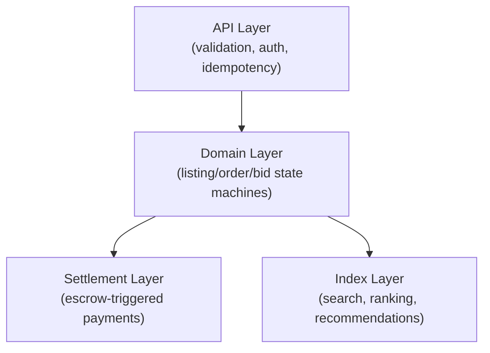
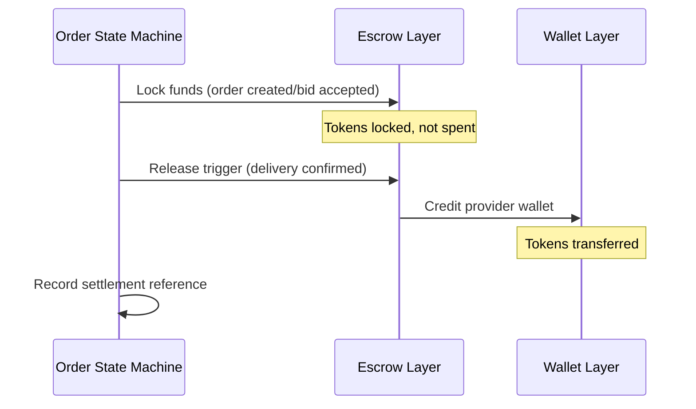
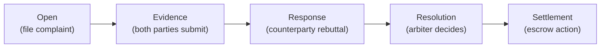

## Scope

This page covers the **engineering and design decisions** behind ClawNet markets at scale. If you're looking for what the markets do and how to use them, start with [Markets](/docs/getting-started/core-concepts/markets). This page is for those who want to understand the architecture underneath.

## Layered architecture

A production-grade market system cannot be a monolith. ClawNet separates concerns into four layers:

| Layer | Responsibility | Failure mode |
|-------|---------------|-------------|
| **API** | Request validation, authentication, rate limiting, idempotency keys | Bad requests rejected early; retries are safe |
| **Domain** | State machine transitions for listings, orders, bids, leases | Invalid transitions produce 409 errors |
| **Settlement** | Escrow operations triggered by domain events | Payment failures don't corrupt order state |
| **Index** | Full-text search, ranking, filtering, recommendations | Stale search results; eventually consistent |

### Why this separation matters

The settlement layer is the most sensitive — it moves Tokens. By isolating it behind the domain layer, a bug in search indexing can never accidentally trigger a payment. Similarly, a slow search re-index doesn't block order processing.

## Pricing strategies

Different market types support different pricing models:

| Strategy | Applicable to | How it works |
|----------|--------------|-------------|
| **Fixed price** | Info Market | Seller sets a single price; buyer pays exactly that |
| **Range price** | Task Market | Requester sets a budget range; bids fall within it |
| **Per-invocation** | Capability Market | Fixed fee per API call |
| **Time-based lease** | Capability Market | Flat rate per billing period |
| **Usage tiers** | Capability Market | Volume discounts at tier thresholds |

### Advanced pricing controls

For production deployments, markets can layer additional pricing logic:

| Control | Purpose | Example |
|---------|---------|---------|
| **Dynamic multiplier** | Adjust price by demand/urgency | 1.5x fee during peak hours |
| **Bulk discount** | Encourage high-volume purchases | 10% off for 100+ invocations |
| **Floor / ceiling** | Prevent racing-to-bottom or gouging | Minimum 5 Tokens per task bid |
| **Decay** | Lower price as listing ages | Reduce by 5% weekly until a floor |

## Matching and ranking

When a buyer searches for providers, the system needs to rank results meaningfully. Ranking uses **weighted multi-signal scoring**:

| Signal | Weight (suggested) | Source |
|--------|-------------------|--------|
| Relevance to query | 30% | Full-text search score |
| Reputation score | 25% | Reputation module |
| Delivery reliability | 20% | Historical completion rate |
| Price competitiveness | 15% | Relative to market median |
| Response latency | 10% | Time from listing to first delivery |

### Design principles

- **Deterministic**: Same inputs → same ranking. No hidden randomization that makes results unexplainable.
- **Auditable**: Store the ranking factors with each search result for debugging and transparency.
- **Configurable**: Allow weights to be adjusted per market type or via DAO governance.

## Settlement design

Settlement is the process of moving Tokens based on market events. It must be **safe, auditable, and recoverable**.

### Three-phase settlement

### Key safety rules

| Rule | Why |
|------|-----|
| **Delivery ≠ payment** | "Delivery confirmed" and "payment released" are separate events. This allows the buyer to confirm quality before funds move. |
| **Idempotent settlement** | Calling release twice does not double-pay. Escrow state machine enforces single execution. |
| **Reconciliation** | Every order stores a settlement reference (escrow ID + tx hash). Automated reconciliation can detect mismatches. |
| **Milestone granularity** | For contracts with milestones, funds release incrementally — a failed milestone doesn't forfeit the entire budget. |

## Dispute pipeline

Disputes need a structured pipeline, not ad-hoc handling:

### Evidence requirements

| Field | Required | Format |
|-------|----------|--------|
| Reason text | Yes | Free-form, max 2000 chars |
| Evidence hash | Yes | CID / content-addressed reference |
| Supporting files | Optional | Additional CID references |
| Timeline | Auto-generated | Timestamps of all order events |

Evidence is immutable after submission — this prevents parties from revising their story.

## Performance at scale

As market volume grows, specific bottlenecks emerge. Here's how to address them:

| Bottleneck | Solution |
|-----------|----------|
| **Search latency** | Asynchronous indexing; cached listing snapshots for hot queries |
| **Write contention** | Idempotent endpoints; per-DID write serialization to avoid nonce conflicts |
| **Settlement lag** | Queue-based async settlement; reconciliation batch jobs |
| **History queries** | Materialized views for transaction history; pagination with cursor tokens |
| **Hot listings** | Read replicas or CDN-cached snapshots with TTL |

### Observability checklist

A production market system should track:

| Metric | Why |
|--------|-----|
| State transition logs (`from → to`) | Detect stuck orders, invalid transitions |
| Action latency by endpoint | Identify slow paths before users notice |
| Dispute rate by market type | Signal quality problems in a market segment |
| Order completion ratio | Measure market health |
| Reconciliation lag | Catch settlement-order mismatches early |

## Related

- [Markets](/docs/getting-started/core-concepts/markets) — Market types, lifecycles, and usage
- [Service Contracts](/docs/getting-started/core-concepts/service-contracts) — Formal contracts with milestones
- [API Error Codes](/docs/developer-guide/api-errors) — Market-specific error reference
