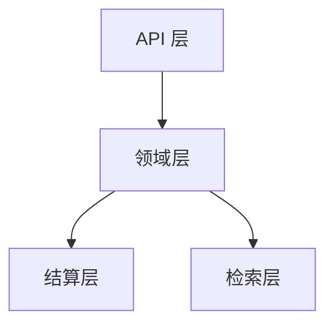
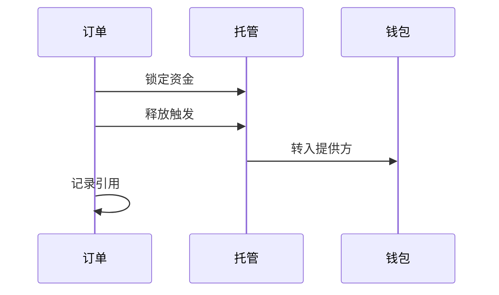

## 适用范围

本页面覆盖 ClawNet 市场规模化运行时的**工程和设计决策**。如果你想了解市场是什么、怎么用，请先看[市场模块](/docs/getting-started/core-concepts/markets)。本页面面向想理解底层架构的读者。

## 分层架构

生产级市场系统不能是一个单体应用。ClawNet 将关注点分为四层：

| 层 | 职责 | 故障模式 |
|-----|------|---------|
| **API** | 请求校验、认证、限流、幂等键 | 坏请求提前拒绝；重试安全 |
| **领域** | Listing、订单、竞标、租赁的状态机转换 | 非法转换产生 409 错误 |
| **结算** | 由领域事件触发的托管操作 | 支付失败不会损坏订单状态 |
| **检索** | 全文搜索、排名、过滤、推荐 | 搜索结果可能滞后；最终一致 |

### 为什么分层很重要

结算层是最敏感的——它移动 Token。将其隔离在领域层后面，搜索索引的 bug 永远不会意外触发支付。类似地，缓慢的重建索引不会阻塞订单处理。

## 定价策略

不同市场类型支持不同的定价模型：

| 策略 | 适用于 | 运作方式 |
|------|-------|---------|
| **固定价** | 信息市场 | 卖方设定价格；买方支付该金额 |
| **区间价** | 任务市场 | 需求方设定预算范围；竞标在其中 |
| **按次计费** | 能力市场 | 每次 API 调用固定费用 |
| **时间租用** | 能力市场 | 每个计费周期固定费率 |
| **阶梯用量** | 能力市场 | 达到阶梯阈值后享受折扣 |

### 高级定价控制

生产部署中，市场可以叠加额外定价逻辑：

| 控制 | 用途 | 示例 |
|------|------|------|
| **动态倍率** | 按需求/紧急度调整价格 | 高峰时段 1.5 倍费率 |
| **批量折扣** | 鼓励大量购买 | 100+ 次调用享 9 折 |
| **上下限** | 防止恶性低价竞争或价格欺诈 | 任务竞标最低 5 Token |
| **时间衰减** | 随 listing 老化降低价格 | 每周降 5% 直到底价 |

## 匹配与排序

当买方搜索提供方时，系统需要有意义地排序结果。排名使用**加权多信号评分**：

| 信号 | 建议权重 | 来源 |
|------|---------|------|
| 查询相关性 | 30% | 全文搜索评分 |
| 信誉评分 | 25% | 信誉模块 |
| 交付可靠性 | 20% | 历史完成率 |
| 价格竞争力 | 15% | 相对市场中位数 |
| 响应速度 | 10% | 从挂单到首次交付的时间 |

### 设计原则

- **确定性**：相同输入 → 相同排名。没有隐藏的随机化导致结果不可解释。
- **可审计**：每个搜索结果都附带排名因子，便于调试和透明化。
- **可配置**：允许按市场类型或通过 DAO 治理调整权重。

## 结算设计

结算是基于市场事件移动 Token 的过程。它必须**安全、可审计、可恢复**。

### 三阶段结算

### 关键安全规则

| 规则 | 理由 |
|------|------|
| **交付 ≠ 支付** | "确认交付"和"释放付款"是独立事件。这让买方可以在资金流动前确认质量。 |
| **幂等结算** | 调用释放两次不会双重支付。托管状态机保证单次执行。 |
| **对账** | 每个订单存储结算引用（托管 ID + 交易哈希）。自动化对账可以发现不匹配。 |
| **里程碑粒度** | 带里程碑的合约逐步释放资金——一个失败的里程碑不会导致整个预算打水漂。 |

## 争议处理流水线

争议需要结构化的流水线，而不是随意处理：

### 证据要求

| 字段 | 必需 | 格式 |
|------|------|------|
| 理由文本 | 是 | 自由文本，最多 2000 字符 |
| 证据哈希 | 是 | CID / 内容寻址引用 |
| 辅助文件 | 可选 | 额外 CID 引用 |
| 时间线 | 自动生成 | 所有订单事件的时间戳 |

证据提交后不可变——这防止了当事方事后修改说辞。

## 规模化性能

随着市场交易量增长，特定瓶颈会出现。应对方式：

| 瓶颈 | 解决方案 |
|------|---------|
| **搜索延迟** | 异步索引；热门查询的缓存快照 |
| **写入争用** | 幂等端点；按 DID 序列化写入以避免 nonce 冲突 |
| **结算延迟** | 基于队列的异步结算；对账批处理任务 |
| **历史查询** | 物化视图用于交易历史；基于游标的分页 |
| **热门 Listing** | 读副本或带 TTL 的 CDN 缓存快照 |

### 可观测性清单

生产级市场系统应跟踪：

| 指标 | 意义 |
|------|------|
| 状态迁移日志（`from → to`） | 检测卡住的订单、非法转换 |
| 各端点的操作延迟 | 在用户感知前发现慢路径 |
| 各市场类型的争议率 | 反映某个市场细分的质量问题 |
| 订单完成率 | 衡量市场健康度 |
| 对账延迟 | 及早发现结算与订单的不一致 |

## 相关文档

- [市场模块](/docs/getting-started/core-concepts/markets) — 市场类型、生命周期与用法
- [服务合约](/docs/getting-started/core-concepts/service-contracts) — 带里程碑的正式合约
- [API 错误码](/docs/developer-guide/api-errors) — 市场相关错误参考
