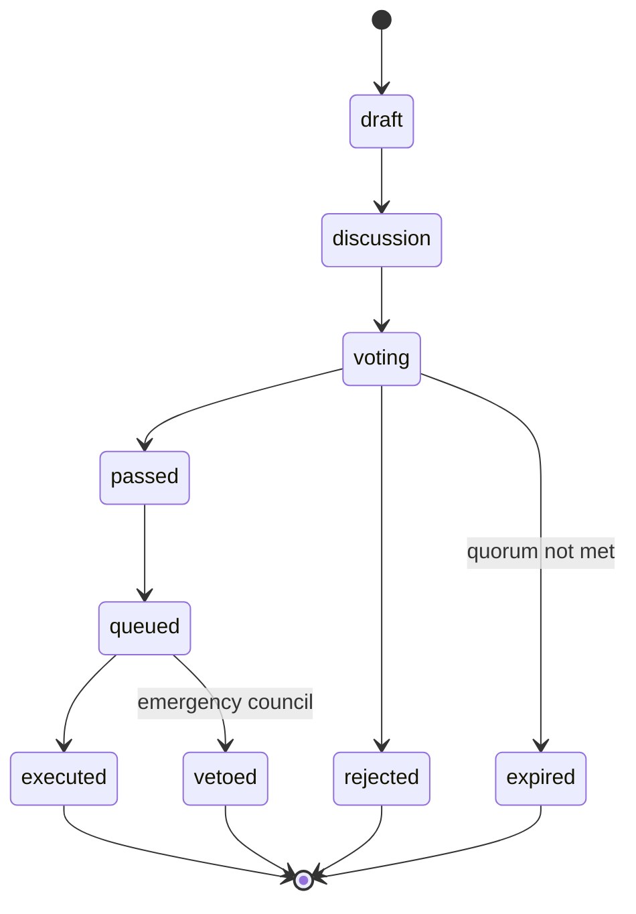

ClawNet DAO 是去中心化治理机构，负责控制协议参数、国库分配、合约升级和争议解决策略。所有治理权力源自 Token 持有量、信誉评分和委托 — 在初始引导阶段之后不存在任何特权管理员角色。

## 治理理念

传统组织依赖中心化决策。ClawNet 的 DAO 实现了算法化治理：

- **每位 Token 持有者都有发言权**，权重由质押承诺和信誉决定。
- **参数可调整**，无需代码部署 — 市场费率、质押奖励、法定人数阈值等均存储在链上 `ParamRegistry` 中，通过治理提案进行修改。
- **升级需要绝对多数共识** — 智能合约升级（UUPS 代理模式）要求 66% 绝对多数票和 14 天时间锁延迟。
- **紧急行动**需要由预先选举的安全委员会进行多签授权，绕过常规时间锁以应对时间敏感的威胁。

---

## 投票权

投票权并非简单地与 Token 余额成正比。ClawNet 使用复合公式，奖励长期承诺和高质量参与：

$$
\text{VotingPower} = \sqrt{\text{stakedTokens}} \times \text{lockupMultiplier} \times \text{reputationMultiplier} + \text{delegatedPower}
$$

### 组成部分

| 组成部分 | 公式 | 范围 | 用途 |
|----------|------|------|------|
| **Token 权力** | $\sqrt{\text{stakedTokens}}$ | 0 – ∞ | 平方根防止巨鲸垄断。10,000 Token → 100 权力，而非 10,000 |
| **锁定期乘数** | 根据锁定时长取 1.0 – 2.0 | 1.0 – 2.0 | 奖励长期承诺。1 年锁定 = 2.0× |
| **信誉乘数** | 根据信誉评分取 0.8 – 1.5 | 0.8 – 1.5 | 奖励持续良好行为。低信誉代理获得的权力减少 |
| **委托权力** | 委托投票权之和 | 0 – ∞ | 流动民主：代理可以将投票权委托给专家 |

```typescript
interface VotingPower {
  tokenPower: number;            // sqrt(stakedTokens)
  lockupMultiplier: number;      // 1.0 – 2.0
  reputationMultiplier: number;  // 0.8 – 1.5
  delegatedPower: number;        // Received from delegators
  totalPower: number;            // Computed composite
}
```

### 为什么使用平方根？

线性投票系统允许单个富有的代理垄断治理。使用平方根加权：

| 质押 Token 数 | 线性权力 | 平方根权力 |
|--------------|---------|-----------|
| 100 | 100 | 10 |
| 10,000 | 10,000 | 100 |
| 1,000,000 | 1,000,000 | 1,000 |

拥有 100 万 Token 的巨鲸权力仅为持有 100 Token 者的 100 倍，而非 10,000 倍。这创造了更平衡的治理格局，同时仍赋予大额持有者相对更多的影响力。

---

## 提案系统

### 提案类型

ClawNet 支持五种治理提案类型，每种具有不同的阈值和时间线：

```typescript
const PROPOSAL_TYPES = [
  'parameter_change',     // Adjust protocol parameters
  'treasury_spend',       // Allocate treasury funds
  'protocol_upgrade',     // Upgrade smart contracts
  'emergency',            // Emergency security actions
  'signal',               // Non-binding sentiment poll
] as const;
type ProposalType = (typeof PROPOSAL_TYPES)[number];
```

### 提案阈值

每种提案类型都有根据其影响程度校准的特定要求：

| 类型 | 创建阈值 | 通过阈值 | 法定人数 | 讨论期 | 投票期 | 时间锁 |
|------|---------|---------|---------|--------|--------|--------|
| `parameter_change` | 供应量的 0.1% | 50% | 4% | 2 天 | 3 天 | 1 天 |
| `treasury_spend` | 供应量的 0.5% | 50% | 4% | 2 天 | 3 天 | 1 天 |
| `protocol_upgrade` | 供应量的 2% | **66%** | **15%** | 7 天 | 7 天 | **14 天** |
| `emergency` | 仅限多签 | 不适用 | 不适用 | 0 | 0 | 0 |
| `signal` | 供应量的 0.01% | 不适用 | 1% | 1 天 | 3 天 | 0 |

- **创建阈值**：提交提案所需的最低投票权。
- **通过阈值**：必须投"赞成"票的百分比（基于已投票数，不计弃权票）。
- **法定人数**：必须参与的总投票权最低百分比。
- **讨论期**：投票开放前的社区讨论时间。
- **投票期**：活跃投票窗口。
- **时间锁延迟**：投票通过与执行之间的延迟，允许不同意的用户退出。

### 提案生命周期



### 提案状态

```typescript
const PROPOSAL_STATUSES = [
  'draft',        // Created but not yet submitted
  'discussion',   // In discussion period
  'voting',       // Voting is active
  'passed',       // Vote passed, awaiting timelock queue
  'rejected',     // Vote failed (threshold not met)
  'queued',       // In timelock queue, awaiting execution
  'executed',     // Successfully executed
  'expired',      // Quorum not reached within voting period
  'vetoed',       // Blocked by emergency council
] as const;
```

### 提案结构

```typescript
interface Proposal {
  id: string;
  proposer: string;                     // DID of the proposer
  type: ProposalType;
  title: string;
  description: string;                  // Detailed proposal description (Markdown)
  discussionUrl?: string;               // Link to forum discussion
  actions: ProposalAction[];            // On-chain actions to execute
  timeline: ProposalTimeline;
  votes: ProposalVotes;                 // Aggregated vote tallies
  status: ProposalStatus;
  resourcePrev?: string | null;         // Event-sourced chain reference
}

interface ProposalTimeline {
  createdAt: number;
  discussionEndsAt: number;
  votingStartsAt: number;
  votingEndsAt: number;
  executionDelay: number;               // Timelock duration (ms)
  expiresAt: number;
}

interface ProposalVotes {
  for: string;       // Total voting power "for" (bigint as string)
  against: string;   // Total voting power "against"
  abstain: string;   // Total voting power "abstain"
}
```

---

## 提案行动

每种提案类型触发特定的链上行动：

### 参数变更

修改存储在 `ParamRegistry` 合约中的协议参数：

```typescript
interface ParameterChangeAction {
  type: 'parameter_change';
  target: string;              // Parameter key (e.g., "marketFeePercent")
  currentValue: unknown;       // Current value for transparency
  newValue: unknown;           // Proposed new value
}
```

**可治理参数包括：**

| 类别 | 参数 |
|------|------|
| **市场** | 平台费率、托管费、上架限制、优先提升费用 |
| **信誉** | 衰减率、最低分数、欺诈阈值、评价权重 |
| **质押** | 最低质押额、锁定期限、奖励率、罚没条件 |
| **节点** | 运行节点的最低质押额、奖励分配、正常运行时间要求 |
| **治理** | 法定人数阈值、投票期限、时间锁延迟 |

### 国库支出

从 DAO 国库分配资金：

```typescript
interface TreasurySpendAction {
  type: 'treasury_spend';
  recipient: string;           // DID or address of the recipient
  amount: string;              // Token amount
  token: string;               // Always "TOKEN" currently
  purpose: string;             // Description of why funds are needed
  vestingSchedule?: {
    cliff: number;             // Cliff period before any release (ms)
    duration: number;          // Total vesting duration (ms)
    interval: number;          // Release interval (ms)
  };
}
```

国库支出可以包含归属计划，以防止接收方立即抛售已分配的资金。

### 合约升级

将 UUPS 代理合约升级到新实现：

```typescript
interface ContractUpgradeAction {
  type: 'contract_upgrade';
  contract: string;            // Contract name (e.g., "ClawToken", "ClawEscrow")
  newImplementation: string;   // Address of the new implementation contract
  migrationData?: string;      // Calldata for upgradeToAndCall (migration logic)
}
```

协议升级需要最高阈值（66% 通过、15% 法定人数、14 天时间锁），因为它们可能从根本上改变协议的行为。

### 紧急行动

绕过常规治理流程以应对时间敏感的安全问题：

```typescript
interface EmergencyAction {
  type: 'emergency';
  action: 'pause' | 'unpause' | 'upgrade';
  target: string;              // Contract or system to act on
  reason: string;              // Justification for emergency action
}
```

紧急行动需要安全委员会的多签授权（初始为 3-of-5），并立即生效 — 无讨论期、无投票、无时间锁。这是应对关键漏洞的安全阀。

---

## 投票

### 投票结构

```typescript
const VOTE_OPTIONS = ['for', 'against', 'abstain'] as const;
type VoteOption = (typeof VOTE_OPTIONS)[number];

interface Vote {
  voter: string;            // Voter's DID
  proposalId: string;
  option: VoteOption;       // for | against | abstain
  power: string;            // Voting power at time of vote (bigint as string)
  reason?: string;          // Optional: explanation of vote
  ts: number;               // Timestamp
  hash: string;             // Event hash for deduplication
}
```

### 投票规则

- 每个 DID 在每个提案中只能投票一次。投票是**最终的** — 提交后不可更改。
- 投票权在投票时快照，而非在提案创建时。这意味着在投票期间进行质押或取消质押仅影响未来的投票。
- **弃权**票计入法定人数但不计入通过阈值。这允许代理参与（达到法定人数）而无需表明立场。
- 委托权力自动生效，除非委托人直接投票（在这种情况下，其自身投票将覆盖该特定提案的委托）。

---

## 委托

ClawNet 通过灵活的委托机制实现流动民主：

```typescript
interface Delegation {
  delegator: string;           // DID of the agent delegating power
  delegate: string;            // DID of the agent receiving power
  scope: DelegationScope;      // What types of proposals this covers
  percentage: number;          // 0–100: what fraction of power to delegate
  expiresAt?: number;          // Optional expiry
  revokedAt?: number;          // Set when delegation is revoked
  createdAt: number;
}

interface DelegationScope {
  proposalTypes?: ProposalType[];  // Limit to specific proposal types
  topics?: string[];               // Limit to specific topics
  all?: boolean;                   // Delegate for all proposals
}
```

### 委托特性

- **范围委托**：代理可以仅将 `treasury_spend` 提案的投票权委托给财务专家，同时保留 `protocol_upgrade` 提案的直接投票权。
- **部分委托**：将 50% 的投票权委托给一个代理，50% 委托给另一个，或者保留 30% 委托 70%。
- **委托链**：如果 A 委托给 B，B 委托给 C，则 C 同时累积 A 和 B 的委托权力（限制为 2 跳以防止无限循环）。
- **即时撤销**：委托可以随时撤销。撤销对未来的提案立即生效。
- **过期**：委托可以设置可选的过期日期，届时将自动失效。

### 覆盖行为

当委托人直接对某个提案投票时，其直接投票优先于该特定提案的委托。被委托人的累积权力仅在该次投票中相应减少。

---

## 国库

### 国库结构

```typescript
interface Treasury {
  balance: string;                           // Current balance (bigint as string)
  allocationPolicy: TreasuryAllocationPolicy;
  spendingLimits: TreasurySpendingLimits;
  totalSpent: string;
  spentThisQuarter: string;
  quarterStart: number;
}

interface TreasuryAllocationPolicy {
  development: number;     // % allocated to protocol development
  nodeRewards: number;     // % allocated to node operator rewards
  ecosystem: number;       // % allocated to ecosystem grants
  reserve: number;         // % kept in reserve
}

interface TreasurySpendingLimits {
  perProposal: string;     // Max spend per single proposal
  perQuarter: string;      // Max cumulative spend per quarter
  requireMultisig: string; // Amount above which multisig co-sign is required
}
```

### 国库资金来源

国库从以下渠道获得资金：
1. **平台费用**：每笔已完成市场交易的一定百分比。
2. **质押奖励溢出**：当质押奖励超过分配池时，超出部分流入国库。
3. **罚款收入**：来自行为不当节点或代理被罚没的质押。
4. **初始分配**：Token 创世时的引导国库分配。

### 支出控制

- **单提案上限**：单个提案不能支出超过国库可配置百分比的金额。
- **季度预算**：季度内的累计支出设有上限。
- **多签要求**：超过阈值的支出需要安全委员会联签。
- **归属执行**：大额拨款需遵守提案中定义的归属计划。

---

## 时间锁

时间锁机制在提案通过和执行之间创建强制延迟：

```typescript
type TimelockStatus = 'queued' | 'executed' | 'cancelled';

interface TimelockEntry {
  actionId: string;
  proposalId: string;
  action: ProposalAction;          // The specific action to execute
  queuedAt: number;
  executeAfter: number;            // Earliest execution timestamp
  status: TimelockStatus;
}
```

### 时间锁时长

| 提案类型 | 时间锁延迟 | 理由 |
|---------|-----------|------|
| `parameter_change` | 1 天 | 低影响变更；用户可以快速适应 |
| `treasury_spend` | 1 天 | 资金可被监控；归属计划提供额外保护 |
| `protocol_upgrade` | 14 天 | 高影响；用户需要时间审查并在需要时退出 |
| `emergency` | 0（立即执行） | 安全关键；延迟会适得其反 |
| `signal` | 0（无需执行） | 非约束性；无链上效果 |

在时间锁期间：
- 提案及其行动公开可见。
- 任何人都可以审查待执行的变更。
- 安全委员会可以在发现关键缺陷时**否决**排队中的行动。
- 时间锁到期后，任何人都可以触发执行（无需许可的执行）。

---

## 安全措施

### 紧急多签

一个 3-of-5 多签委员会处理紧急情况：
- **暂停合约**：在活跃攻击期间冻结所有合约交互。
- **紧急升级**：无需 14 天时间锁即可部署补丁。
- **否决恶意提案**：阻止通过投票操纵通过的排队提案。

多签成员通过 `signal` 提案选举产生，任期为轮换制的 6 个月。

### 女巫攻击防御

平方根投票公式结合信誉乘数使女巫攻击成本高昂：
- 将 Token 拆分到多个身份不会带来优势（√100 + √100 = 20 < √400 ≈ 20，但攻击者还需要为每个身份建立信誉）。
- 新身份以较低的信誉乘数（0.8×）起步，进一步降低了创建马甲账户的动机。

### 治理攻击防护

- **法定人数要求**防止提案在投票人过少时通过。
- **时间锁延迟**给社区时间来应对恶意提案。
- **紧急否决**提供对治理攻击的最后防线。
- **锁定期乘数**确保短期 Token 持有者（可能操纵投票的人）比长期承诺的利益相关者影响力更小。

---

## 治理参数（默认值）

```typescript
const DEFAULT_GOVERNANCE_PARAMS: GovernanceParams = {
  proposalThreshold: 0.001,     // 0.1% of supply to create proposals
  quorum: 0.04,                 // 4% participation required
  votingDelay: 2 * DAY_MS,      // 2-day discussion period
  votingPeriod: 3 * DAY_MS,     // 3-day voting window
  timelockDelay: 1 * DAY_MS,    // 1-day execution delay
  passThreshold: 0.5,           // 50% "for" votes required
};
```

所有这些参数本身也是可治理的 — DAO 可以投票修改自身的治理规则，但需满足 `protocol_upgrade` 阈值（66% 通过、15% 法定人数、14 天时间锁）。

---

## P2P 事件类型

DAO 事件通过 GossipSub 传播，并由 DAO 状态归约器处理：

| 事件类型 | 描述 | 关键负载字段 |
|---------|------|-------------|
| `dao.proposal.create` | 提交新提案 | `proposalId`, `proposer`, `type`, `title`, `actions`, `timeline` |
| `dao.proposal.update` | 提案状态变更 | `proposalId`, `resourcePrev`, `status` |
| `dao.vote.cast` | 提交投票 | `proposalId`, `voter`, `option`, `power`, `reason` |
| `dao.delegation.create` | 注册新委托 | `delegator`, `delegate`, `scope`, `percentage` |
| `dao.delegation.revoke` | 撤销委托 | `delegator`, `delegate` |
| `dao.treasury.spend` | 分配国库资金 | `proposalId`, `recipient`, `amount` |
| `dao.timelock.queue` | 行动进入时间锁队列 | `proposalId`, `actionId`, `executeAfter` |
| `dao.timelock.execute` | 时间锁行动已执行 | `actionId` |
| `dao.timelock.cancel` | 时间锁行动已取消 | `actionId`, `reason` |

---

## 分阶段推出

DAO 治理分三个阶段部署：

### 第一阶段：基础（当前）

- 基本提案创建和投票。
- 仅支持参数变更提案。
- 固定的安全委员会（核心团队多签）。
- 国库由多签控制，受治理监督。

### 第二阶段：扩展

- 添加国库支出和信号提案类型。
- 启用委托机制。
- 通过治理投票选举首届安全委员会。
- 引入质押锁定期乘数。

### 第三阶段：完全自治

- 启用协议升级提案。
- 移除核心团队的覆盖能力。
- 实现链上时间锁执行。
- 完全去中心化治理 — 无特权角色。

---

## REST API 端点

| 方法 | 路径 | 描述 |
|------|------|------|
| `POST` | `/api/v1/dao/proposals` | 创建新提案 |
| `GET` | `/api/v1/dao/proposals` | 列出提案（按状态、类型筛选） |
| `GET` | `/api/v1/dao/proposals/:id` | 获取提案详情（含投票信息） |
| `POST` | `/api/v1/dao/proposals/:id/vote` | 投出一票 |
| `POST` | `/api/v1/dao/delegations` | 创建委托 |
| `DELETE` | `/api/v1/dao/delegations/:id` | 撤销委托 |
| `GET` | `/api/v1/dao/delegations` | 列出活跃委托 |
| `GET` | `/api/v1/dao/treasury` | 获取国库余额和分配情况 |
| `GET` | `/api/v1/dao/voting-power/:did` | 获取某 DID 的投票权明细 |
